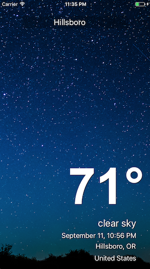
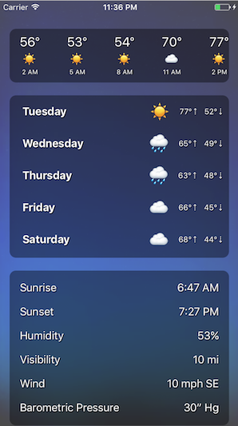
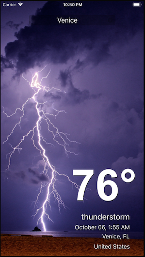
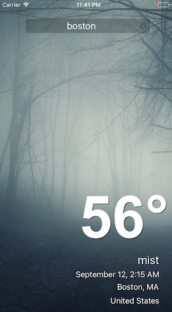

#  WeatherApp
## Features
* Search by location name, zipcode anywhere in the world
* Auto-search based on your GPS location
* View current weather conditions
* Scroll to view hourly and daily forecasts for the next 5 days
* Beautiful background images that are contextual to the current weather conditions and time of day for the location you searched for
* Support for metric vs. imperial units for all weather information based on device's locale
* Forecasts are presented in local time relative to the location you searched for

## Screenshots
### Current Conditions

### Forecast & Details

### Metric unit support

### Contextual Images

## Backlog
*Small item backlog*
* Finish fleshing out test coverage
* show network indicator during network requests
* shorter network timeouts & better UX when internet is unavailable
* pull to refresh
* allow user to search again via GPS (GPS search is currently only performed on load)
* more contextual images: extreme weather conditions, more options for common conditions (clear sky, clouds, rain, etc)

*Feature Backlog*
* Location history
* * save search history
* * view past searches and allow for select
* * display current temperature for each location on the history screen (using bulk API)
* * allow for deletion of previous search results
